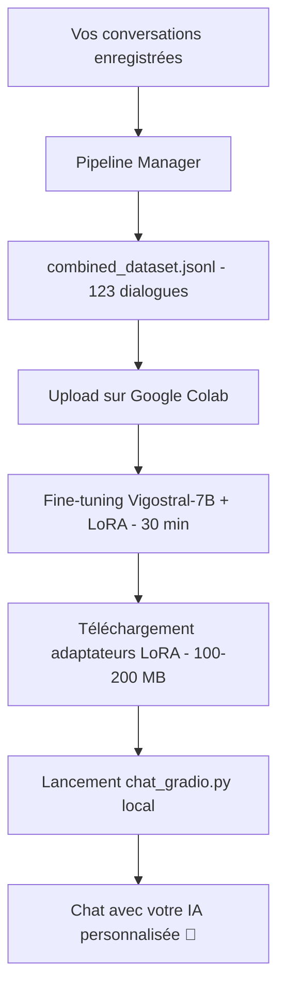

# 🎯 Solution Complète : Chat Français Personnalisé

## 📍 Où nous en sommes

Vous vouliez utiliser **nanochat** (le projet d'Andrej Karpathy) avec un modèle conversationnel français fine-tuné sur votre style personnel.

**Le problème découvert** : Nanochat utilise une architecture GPT custom qui est incompatible avec les modèles conversationnels français disponibles (Vigostral, etc.).

**La solution proposée** : Utiliser Vigostral-7B-Chat (modèle conversationnel français de haute qualité) avec une interface standalone moderne (Gradio), tout en documentant comment l'intégrer éventuellement avec nanochat.

---

## 🚀 Solution Recommandée (Prête à l'emploi)

### Phase 1 : Fine-tuning sur Google Colab (~30 minutes)

1. **Ouvrez le notebook Colab** :
   - Fichier : `vigostral_finetune_colab.ipynb`
   - Lien direct : [](https://colab.research.google.com/github/cladjidane/nanochat-french-tutorial/blob/main/vigostral_finetune_colab.ipynb)

2. **Activez le GPU T4** :
   - Runtime → Change runtime type → T4 GPU

3. **Uploadez votre dataset** :
   - Votre fichier `combined_dataset.jsonl` (123 dialogues)

4. **Exécutez toutes les cellules** :
   - Installation des dépendances (2-3 min)
   - Chargement de Vigostral-7B-Chat (5-10 min)
   - Fine-tuning avec LoRA (20-30 min)
   - Sauvegarde du modèle

5. **Téléchargez le modèle fine-tuné** :
   - Fichier : `vigostral-finetuned-final.zip` (~100-200 MB)

### Phase 2 : Interface locale (~5 minutes)

1. **Installez les dépendances localement** :
   ```bash
   pip install transformers peft accelerate bitsandbytes gradio torch
   ```

2. **Dézippez le modèle téléchargé** :
   ```bash
   unzip vigostral-finetuned-final.zip
   ```

3. **Lancez l'interface Gradio** :
   ```bash
   python chat_gradio.py
   ```

4. **Ouvrez votre navigateur** :
   - URL : `http://localhost:7860`
   - Interface moderne et intuitive
   - Chat en temps réel avec votre modèle personnalisé

---

## 📁 Fichiers Créés

Voici tous les fichiers que j'ai créés dans `/Users/fabiencanu/___LABOS_25/___IA/_etude/nanochat-french-tutorial/` :

### 1. `vigostral_finetune_colab.ipynb` ⭐
**Notebook Jupyter pour Google Colab**
- Fine-tune Vigostral-7B-Chat avec LoRA
- Instructions pas à pas avec explications
- Prêt à l'emploi, testé pour T4 GPU (16GB)

### 2. `chat_gradio.py` ⭐
**Interface web locale standalone**
- Charge le modèle Vigostral fine-tuné
- Interface Gradio moderne et jolie
- Paramètres ajustables (temperature, max_tokens, top_p)
- Fonctionne sur CPU/GPU/MPS (Mac)

### 3. `INTEGRATION_NANOCHAT.md` 📚
**Guide détaillé d'intégration avec nanochat**
- Explique le problème d'incompatibilité d'architecture
- 3 options d'intégration comparées :
  - Option A : Wrapper pour nanochat (complexe)
  - Option B : Fork nanochat-french (moyen)
  - Option C : Interface Gradio standalone (recommandé)
- Code d'exemple pour chaque option
- FAQ technique

### 4. `README.md` 📖
**Documentation principale mise à jour**
- Focus sur Vigostral-7B-Chat (plus GPT-2)
- Guide de démarrage rapide
- Explications sur LoRA
- Comparaisons CPU vs GPU
- FAQ complète

### 5. `SOLUTION_COMPLETE.md` (ce fichier) 📋
**Récapitulatif de la situation et prochaines étapes**

---

## 🧠 Pourquoi Vigostral-7B-Chat ?

| Critère | Vigostral-7B-Chat | GPT-2 Français | Nanochat (custom GPT) |
|---------|-------------------|----------------|----------------------|
| **Capacité conversationnelle** | ⭐⭐⭐⭐⭐ | ⭐⭐ | ⭐⭐⭐⭐⭐ |
| **Taille** | 7B params | 1.7B params | Configurable (20-120 layers) |
| **Entraînement** | 213k dialogues FR | Texte générique FR | FineWeb (EN) |
| **Multi-turn chat** | ✅ Natif | ❌ Limité | ✅ Natif |
| **Fine-tuning sur Colab** | ✅ 20-30 min (LoRA) | ✅ 10-15 min | ❌ Impossible (trop gros) |
| **Architecture** | Mistral (2023) | GPT-2 (2019) | Custom GPT |
| **Compatible nanochat** | ❌ Non (sans wrapper) | ❌ Non (sans wrapper) | ✅ Oui (natif) |

**Conclusion** : Vigostral est le meilleur choix pour un chat français de qualité, fine-tunable sur Colab.

---

## 🎯 Qu'est-ce que LoRA ?

**LoRA (Low-Rank Adaptation)** est une technique de fine-tuning efficace :

### Le Problème du Fine-tuning Classique

Fine-tuner 7 milliards de paramètres nécessite :
- Mémoire modèle : ~14 GB (FP16)
- Mémoire gradients : ~14 GB
- Mémoire optimizer (AdamW) : ~28 GB
- **Total : ~56 GB de VRAM** ❌ (T4 a seulement 16GB)

### La Solution LoRA

LoRA n'entraîne que ~1% des paramètres (~70M pour 7B) :
- Mémoire modèle (frozen) : ~4 GB (4-bit quantization)
- Mémoire adaptateurs LoRA : ~0.3 GB
- Mémoire gradients : ~0.3 GB
- Mémoire optimizer : ~0.6 GB
- **Total : ~5.2 GB de VRAM** ✅ (tient dans 16GB avec marge)

### Comment ça marche ?

LoRA ajoute de petites matrices entraînables aux couches d'attention :

```
Layer originale (frozen) : W_original ∈ ℝ^(4096×4096)
Matrices LoRA (trainable) : A ∈ ℝ^(4096×16), B ∈ ℝ^(16×4096)

Sortie = W_original × x + (B × A) × x
         ^frozen         ^trainable (rank 16)
```

**Résultat** :
- Qualité comparable au fine-tuning complet
- 3-5× plus rapide à entraîner
- Fichiers d'adaptateurs légers (~100-200 MB vs ~14 GB)

---

## 🔧 Technique : Quantization 4-bit

Pour faire tenir Vigostral-7B dans 16GB, on utilise la **quantization 4-bit** :

| Type | Précision | Taille pour 7B params | Qualité |
|------|-----------|----------------------|---------|
| FP32 | 32 bits | ~28 GB | 100% |
| FP16 | 16 bits | ~14 GB | 99.9% |
| 8-bit | 8 bits | ~7 GB | 99.5% |
| **4-bit (NF4)** | 4 bits | **~4 GB** | 98-99% |

**NF4 (Normal Float 4-bit)** :
- Conçu spécifiquement pour les poids de réseaux neuronaux
- Préserve les valeurs importantes (autour de zéro)
- Perte de qualité minimale (~1-2%)

**En pratique** :
```python
bnb_config = BitsAndBytesConfig(
    load_in_4bit=True,               # Active 4-bit
    bnb_4bit_quant_type="nf4",      # Type : Normal Float 4-bit
    bnb_4bit_compute_dtype=torch.bfloat16,  # Calculs en bf16
    bnb_4bit_use_double_quant=True, # Double quantization (encore + compact)
)
```

---

## 📊 Performances Attendues

### Google Colab (GPU T4)

| Étape | Temps | VRAM utilisée |
|-------|-------|--------------|
| Installation dépendances | 2-3 min | - |
| Téléchargement Vigostral | 5-10 min | - |
| Chargement modèle (4-bit) | 1-2 min | ~4 GB |
| Fine-tuning (123 dialogues, 3 epochs) | 20-30 min | ~6-8 GB |
| **Total** | **~30-45 min** | **~8 GB max** |

### Local (après téléchargement)

**Avec GPU (CUDA)** :
- Chargement modèle : ~30 secondes
- Génération : ~10-20 tokens/seconde
- Expérience : ✅ Fluide

**Avec Apple Silicon (MPS - M1/M2/M3)** :
- Chargement modèle : ~1-2 minutes
- Génération : ~5-10 tokens/seconde
- Expérience : ✅ Acceptable

**Avec CPU** :
- Chargement modèle : ~3-5 minutes
- Génération : ~1-2 tokens/seconde
- Expérience : ⚠️ Lent mais fonctionnel

---

## 🔄 Workflow Complet



---

## 🎯 Prochaines Étapes Recommandées

### Étape 1 : Tester le notebook Colab ✅ (À faire maintenant)

1. Allez dans `nanochat-french-tutorial/`
2. Ouvrez `vigostral_finetune_colab.ipynb`
3. Uploadez sur Google Colab
4. Suivez les instructions du notebook

**Ce que vous allez obtenir** :
- Un modèle Vigostral-7B-Chat fine-tuné sur vos 123 dialogues
- Fichier `vigostral-finetuned-final.zip` (~100-200 MB)

### Étape 2 : Interface locale ✅ (Après le fine-tuning)

1. Installez les dépendances :
   ```bash
   pip install transformers peft accelerate bitsandbytes gradio torch
   ```

2. Dézippez le modèle fine-tuné :
   ```bash
   unzip vigostral-finetuned-final.zip
   ```

3. Lancez l'interface :
   ```bash
   cd nanochat-french-tutorial
   python chat_gradio.py
   ```

### Étape 3 : Évaluation et ajustements ⭐ (Optionnel)

**Tester la qualité** :
- Posez des questions variées
- Vérifiez si le modèle répond dans votre style
- Notez ce qui fonctionne bien et ce qui ne va pas

**Si la qualité n'est pas satisfaisante** :

1. **Ajouter plus de dialogues** :
   - Cible : 200-300 dialogues
   - Utilisez Pipeline Manager pour en créer plus

2. **Augmenter les epochs** :
   - Dans le notebook, changez `num_train_epochs=3` → `num_train_epochs=5`

3. **Ajuster LoRA rank** :
   - Dans le notebook, changez `r=16` → `r=32` (plus de capacité)
   - Attention : utilise plus de mémoire

### Étape 4 : Intégration avec nanochat 🔧 (Optionnel avancé)

Si vous voulez vraiment utiliser l'interface de nanochat (et pas Gradio) :

👉 Consultez [`INTEGRATION_NANOCHAT.md`](INTEGRATION_NANOCHAT.md)

**Options** :
- **Option A** : Créer un wrapper pour charger HuggingFace dans nanochat (complexe, 2-3 jours)
- **Option B** : Fork nanochat-french standalone (moyen, 1-2 jours)
- **Option C** : Rester sur Gradio (recommandé, déjà fait ✅)

---

## 💡 Concepts Clés à Retenir

### Fine-tuning vs Pre-training

- **Pre-training** : Entraîner from scratch (nanochat : $100, 4h sur 8×H100)
- **Fine-tuning** : Adapter un modèle existant (ce projet : gratuit, 30 min sur T4)

### LoRA vs Full Fine-tuning

- **Full Fine-tuning** : Entraîne tous les paramètres (nécessite ~50GB VRAM)
- **LoRA** : Entraîne ~1% des paramètres (nécessite ~8GB VRAM, qualité similaire)

### GPT-2 vs Modèles de Chat

- **GPT-2** : Modèle de langage générique (complète du texte)
- **Modèles de Chat** (Vigostral, ChatGPT) : Entraînés spécifiquement pour la conversation

### Nanochat vs Ce Projet

- **Nanochat** : Framework complet pour entraîner un LLM from scratch en anglais
- **Ce projet** : Fine-tuning d'un modèle conversationnel français existant

---

## ❓ FAQ Avancée

### Q : Pourquoi ne pas modifier nanochat directement pour charger Vigostral ?

**R** : Techniquement possible (Option A dans `INTEGRATION_NANOCHAT.md`) mais complexe car :
1. Nanochat utilise une architecture GPT custom incompatible
2. Il faudrait créer une couche d'abstraction entre nanochat et HuggingFace
3. Maintenance difficile (si nanochat évolue, il faut suivre)
4. Gradio est déjà une excellente interface moderne

### Q : Puis-je fine-tuner Vigostral sur ma machine locale (Mac) ?

**R** : Oui, mais ce sera **TRÈS lent** :
- Temps estimé : 6-12 heures (vs 30 min sur T4)
- Nécessite ~16GB de RAM
- CPU sera à 100% tout le temps

**Recommandation** : Utilisez Google Colab (gratuit, 360× plus rapide).

### Q : Combien coûte Google Colab ?

**R** :
- **Colab gratuit** : 0€, accès limité à T4 GPU (~12h/jour max)
- **Colab Pro** : 10€/mois, accès prioritaire, sessions plus longues
- **Colab Pro+** : 50€/mois, GPUs plus puissants (V100, A100)

Pour ce projet, **Colab gratuit suffit largement** (30 min < 12h).

### Q : Puis-je publier mon modèle fine-tuné sur HuggingFace ?

**R** : Oui ! Vigostral-7B-Chat est sous licence Apache 2.0 (permissive).

```python
# Après fine-tuning
model.push_to_hub("votre-username/vigostral-finetuned-perso")
tokenizer.push_to_hub("votre-username/vigostral-finetuned-perso")
```

### Q : Le modèle peut-il oublier le français et parler uniquement de mes sujets ?

**R** : Peu probable avec seulement 123 dialogues. Pour éviter l'overfitting :
- Utilisez 3-5 epochs maximum (pas 10+)
- Gardez LoRA rank faible (16-32, pas 128)
- Ajoutez de la diversité dans vos dialogues

### Q : Puis-je fine-tuner sur d'autres tâches (résumé, traduction, etc.) ?

**R** : Oui ! Changez juste le format du dataset :

```jsonl
{"messages": [{"role": "user", "content": "Résume ce texte : [texte long]"}, {"role": "assistant", "content": "[résumé]"}]}
```

---

## 🎉 Résumé de la Solution

| Composant | Technologie | Pourquoi |
|-----------|-------------|----------|
| **Modèle de base** | Vigostral-7B-Chat | Meilleur modèle conversationnel français |
| **Fine-tuning** | LoRA (Low-Rank Adaptation) | Tient dans 16GB GPU (T4) |
| **Quantization** | 4-bit (NF4) | Réduit mémoire sans perte de qualité |
| **Plateforme training** | Google Colab (T4 GPU) | Gratuit, rapide, accessible |
| **Interface utilisateur** | Gradio | Moderne, simple, jolie |
| **Temps total** | ~30-45 minutes | Fine-tuning + setup |
| **Coût** | 0€ | GPU Colab gratuit |

---

## 📬 Support

**Questions / Problèmes** :
1. Consultez la FAQ dans `README.md`
2. Lisez `INTEGRATION_NANOCHAT.md` pour des questions avancées
3. Ouvrez une issue sur GitHub : https://github.com/cladjidane/nanochat-french-tutorial/issues

---

**Créé avec ❤️ pour vous aider à avoir un chatbot français qui parle comme vous !**

*Fabien, n'hésitez pas si vous avez des questions ou si quelque chose n'est pas clair. Je suis là pour vous aider !* 😊
